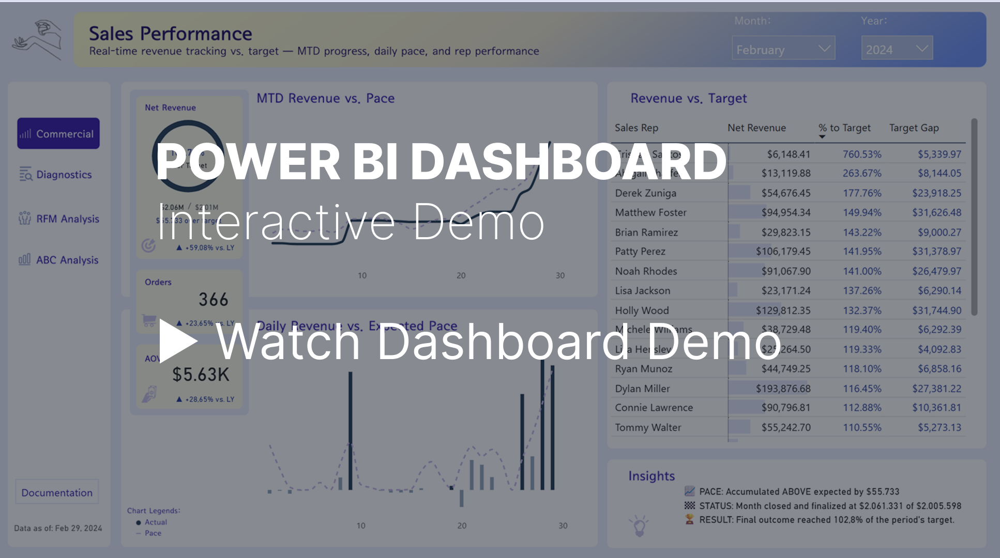
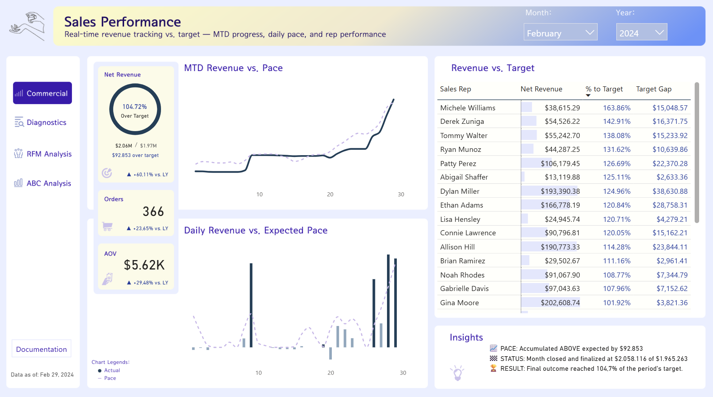
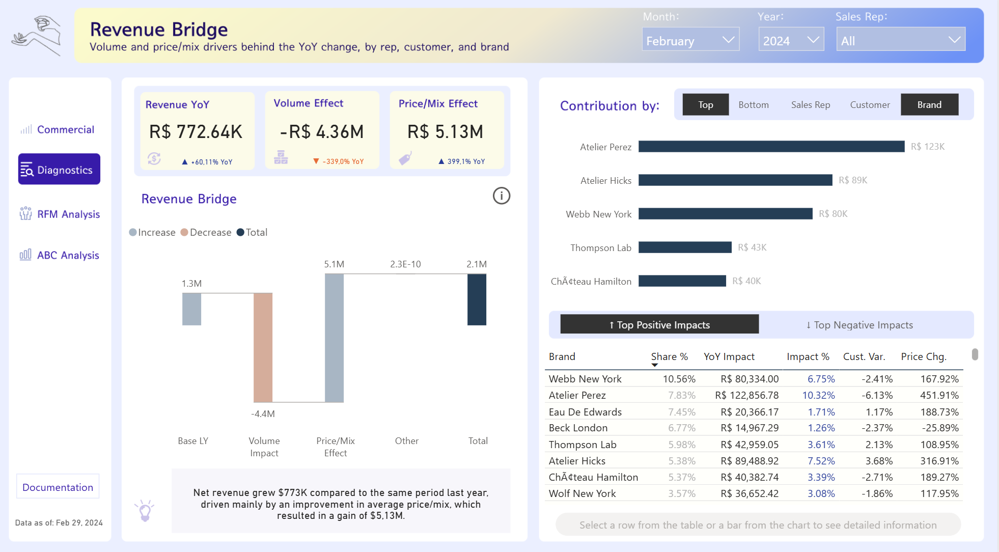
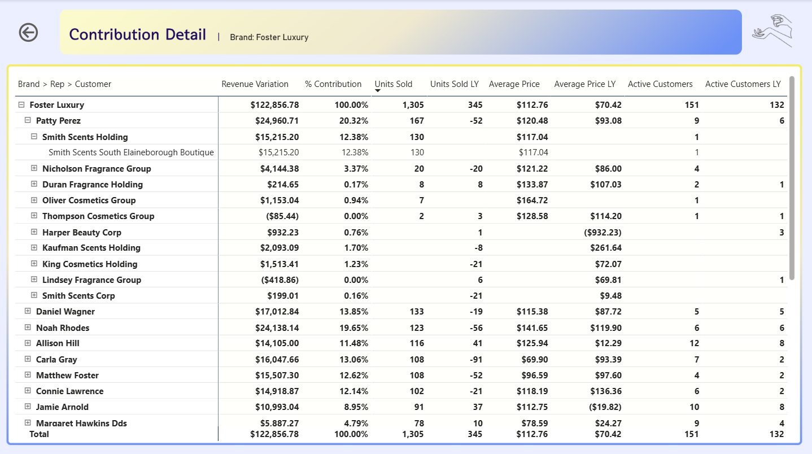
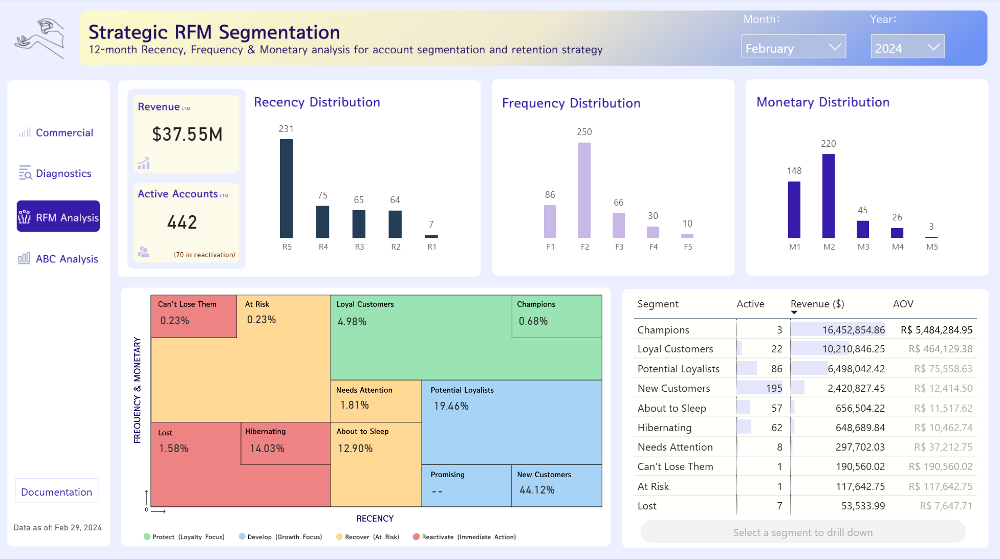
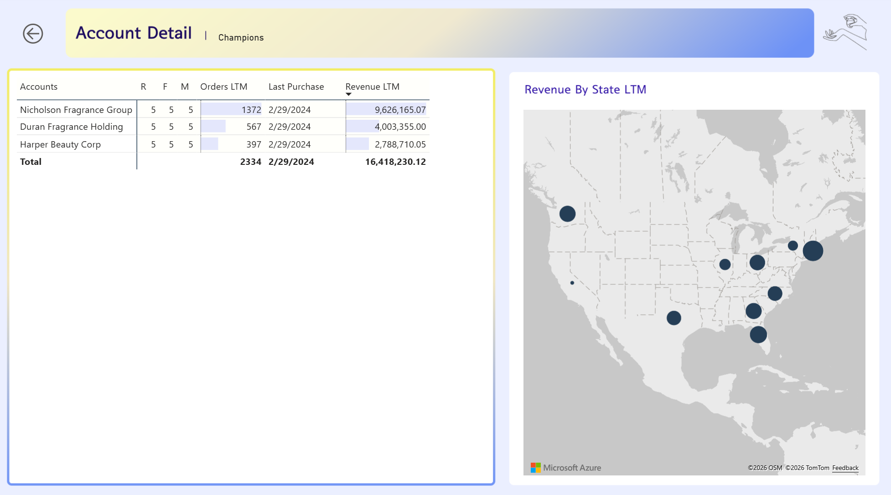
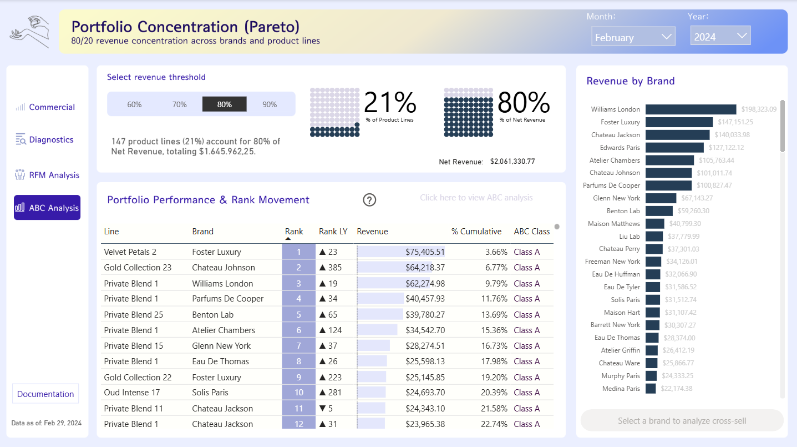
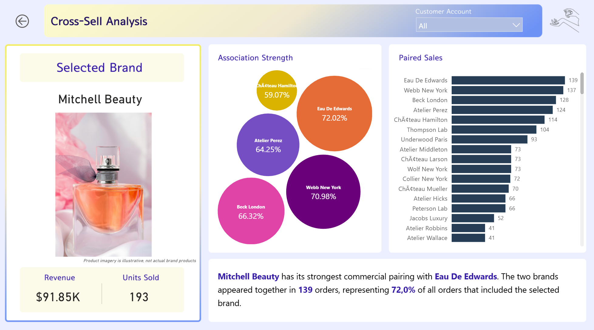

# 🧴Perfume Distribution — Sales Analytics Dashboard

---

*Click the image above to watch a 1-minute walkthrough of the dashboard.*

---

## Overview
An end-to-end sales analytics project covering the full pipeline from raw data generation to an interactive Power BI dashboard. It includes revenue tracking against target, a breakdown of YoY performance into volume vs. price/mix effects, RFM-based customer segmentation, and Pareto/ABC portfolio concentration analysis.

---

## Business Context
This project is based on real-world experience as an operations analyst at a perfume and cosmetics distribution company. Although it wasn't part of my formal role, I noticed the sales team's only performance-tracking tool was a spreadsheet with a "thermometer" chart per rep, comparing revenue to target — no historical trend, no drill-down, no way to see what was actually driving the numbers.

Since I was studying data analytics on the side, I saw an opportunity to build something more useful: a centralized dashboard covering not just revenue vs. target, but also YoY performance drivers, customer segmentation, and portfolio concentration — insights the team didn't have visibility into before.

---

## Data Note
The original company name, employees, customers, and financial figures have been fully anonymized — all data in this repository is synthetic, generated to mirror the structure, scale, and data quality challenges of the original production system (including realistic "dirty data" scenarios like inconsistent categorization, duplicate records, and missing values).

The goal of this project is to demonstrate the type of ETL, data cleaning, and business intelligence work performed in that role, translated into a US-market context (schema, currency, and terminology).

---

## Tech Stack
- **Python** (pandas) — synthetic data generation and cleaning pipeline
- **Power BI** (Power Query, DAX) — data modeling and dashboard

---

## Dashboard Pages
### 1. Sales Performance
Provides an executive view of revenue performance against target, combining overall KPIs, sales representative performance, and revenue pacing to identify whether the business is on track to achieve its goal.

 

**Key findings — February 2024:** 
- **Revenue exceeded target, but performance was not consistent throughout the month.**  
Revenue closed at $2.06M, 102.78% of target — a $55.7K beat. The month saw significant negative pacing through most of the period, with performance turning positive only in the final days.

- **Growth was driven by both higher order volume and larger transactions.**  
Revenue increased 59.08% vs. LY, supported by a 23.65% increase in orders and a 28.65% increase in AOV, indicating that growth came from both increased sales activity and higher-value transactions.

- **Overall target achievement masks significant differences across sales representatives**  
Although the business exceeded its overall target, individual sales representatives showed substantial variation in target attainment, highlighting areas of strong performance as well as potential opportunities for management attention.

### 2. Revenue Bridge 
Provides a diagnostic view of the year-over-year revenue change, decomposing performance into volume and price/mix effects and allowing users to identify the sales representatives, customers, or brands contributing most to the change.

<b>Key findings — February 2024</b>

 
**Key findings — February 2024:** 
- **Revenue growth was primarily driven by price/mix improvements, which more than offset a significant decline in volume.**  
Net revenue increased $765.5K vs. LY, as a $5.25M positive price/mix effect more than offset a $4.48M decline in volume — the company sold less units, but at meaningfully higher average value.

- **Revenue growth was most concentrated at the customer level.**  
The top five customers contributed approximately $814K in incremental revenue, exceeding the company's $765.5K net YoY gain. By comparison, the top five sales reps contributed $625K, while the top five brands contributed $370K. This indicates that YoY growth was particularly concentrated among a small group of key customers, with declines elsewhere offsetting part of their contribution.

- **The diagnostic breakdown helps identify where and why revenue changed.**  
By switching between Sales Rep, Customer, and Brand, and between Top/Bottom and Positive/Negative impacts, the analysis moves beyond the overall revenue result to identify the specific contributors and drivers behind the YoY change.

<b>Drillthrough → Contribution Detail</b>

> **Drillthrough → Contribution Detail**  
> Provides a detailed breakdown of revenue variation for a selected brand, sales representative, or customer, allowing users to trace the underlying contribution across the Brand → Rep → Customer hierarchy > while comparing units sold, pricing, and customer activity against the previous year.
>
> 
>
> **Example — Foster Luxury**
> - **Foster Luxury generated $122.9K in positive YoY revenue variation.**  
> The brand sold 1,305 units vs. 345 LY, while average price increased from $70.42 to $112.76, indicating that both higher volume and higher pricing contributed to the revenue increase. Its active customer
>base also increased, from 132 last year to 151, further supporting the brand's revenue growth.
>
> - **Growth was spread across several sales representatives, with Patty Perez as the largest contributor.**  
> Patty Perez contributed $25.0K, followed by Noah Rhodes ($24.1K) and Daniel Wagner ($17.0K). The hierarchy can then be expanded to identify the customers behind each representative's contribution — for
> example, Smith Scents Holding accounted for $15.2K of Patty Perez's contribution.
>
> - **The drillthrough provides a detailed path from overall brand performance to individual customer relationships.**  
> By expanding Brand → Rep → Customer, users can identify the specific commercial relationships behind the selected entity's revenue variation and compare their volume, pricing, and customer activity
>against LY.

### 3. Strategic RFM Segmentation
Provides a 12-month Recency, Frequency, and Monetary analysis to segment accounts by customer value and engagement, supporting retention, development, and reactivation strategies.

**Key findings — February 2024:** 
- **Revenue is highly concentrated among a small group of high-value customers.**  
Champions and Loyal Customers represent only 25 of 442 active accounts (~6%), yet account for approximately $26.7M of $37.6M in revenue (~71%). This highlights the importance of protecting and retaining the highest-value accounts.

- **The customer base is heavily weighted toward new and lower-value accounts.**  
New Customers represent 195 accounts (~44% of the active base) but contribute approximately $2.4M (~6.5%) of revenue, indicating significant potential to increase customer value through retention and development.

- **The segmentation highlights distinct retention and reactivation opportunities.**  
While high-value segments require protection, a meaningful portion of the customer base falls into Hibernating, About to Sleep, and Needs Attention segments. These accounts represent potential reactivation and retention opportunities before further declines in engagement and value.

> **Drillthrough → Account Detail**  
> Provides a detailed view of accounts within a selected RFM segment, combining recency, frequency, monetary value, purchasing activity, and geographic distribution to support targeted customer retention > and engagement strategies.
> 
> 
> 
> **Example — Champions**
> - **Champions represented a small but highly valuable group of customers.**  
> The segment contained just 3 active accounts, generating $16.45M in LTM revenue across 2,334 orders.
> 
> - **Revenue was concentrated among the segment's top accounts.**  
> Nicholson Fragrance Group generated $9.65M, accounting for approximately 59% of Champions' LTM revenue, followed by Duran Fragrance Holding ($4.01M) and Harper Beauty Corp ($2.79M).
> 
> - **The drillthrough connects customer segmentation with actionable account-level detail.**  
> Users can identify the individual accounts within each RFM segment, evaluate their purchase frequency, LTM revenue, and most recent purchase, and use the geographic view to understand where high-value
>customers are located.

### 4. Portfolio Concentration (Pareto)
Provides an 80/20 analysis of revenue concentration across brands and product lines, identifying the products that account for the majority of revenue and enabling users to drill through to detailed cross-sell analysis for selected brands.

**Key findings — February 2024:**
- **Revenue was highly concentrated across a small portion of the portfolio.**  
At the 80% revenue threshold, just 147 products (21% of the portfolio) generated approximately $1.65M, representing 80% of total net revenue. This highlights the disproportionate contribution of a relatively small group of products.

- **The Pareto distribution highlights clear portfolio prioritization opportunities.**  
The concentration of revenue among a limited number of product lines suggests that these high-contribution products should receive greater attention in areas such as inventory availability, commercial focus, and performance monitoring.

- **An expandable ABC breakdown and brand-level drillthrough extend the analysis further.**  
Clicking into the ABC classification view breaks the same portfolio into Class A, B, and C based on cumulative contribution, and selecting any brand from the graph opens a drillthrough into Cross-Sell Analysis to explore purchasing relationships with other brands.

> **Drillthrough → Cross-Sell Analysis**  
> Selecting a brand from the Revenue by Brand visual (Page 4) activates the drillthrough navigation, allowing users to investigate cross-selling relationships between brands.
> 
> 
> 
> **Example — Benton Lab**
> - **Benton Lab's strongest cross-sell relationship was with Chateau Jackson.**  
> The two brands appeared together in 25 orders, representing 71.4% of all orders that included Benton Lab — the highest pairing rate among all brands analyzed.
> 
> - **The paired sales ranking shows how strongly other brands co-occur with the selected one.**  
> Beyond the top match, the ranking lists every brand's order overlap with Benton Lab, helping identify secondary pairing opportunities beyond the single strongest relationship.
>
>- **This view supports cross-sell and bundling decisions at the brand level.**  
> By selecting any brand from the Portfolio Concentration page, users can identify which other brands are most commonly purchased together — useful for promotional bundling, assortment planning, or sales
>rep guidance on complementary offers.

---

## Repository Structure

perfume-distribution-analytics/

├── `data/` # Raw and cleaned datasets (Aug 2021 – Feb 2024)

├── `notebooks/` # Data cleaning scripts (Python)

├── `assets/` Dashboard screenshots

├── `dashboard/` # Power BI dashboard files (.pbix)

├── `README.md` # Project documentation (this file)

---

## Data Pipeline
Raw generation → Data quality validation → Cleaning & business rules → Power BI model

---

## Key Features
- Revenue vs. target tracking with MTD pace projection
- YoY revenue bridge (volume vs. price/mix decomposition)
- RFM customer segmentation
- ABC/Pareto portfolio analysis with cross-sell insights

---

## Setup
1. Set the `PRESTIGE_DATA_PATH` environment variable (or edit the path directly in the notebooks)
2. Run notebooks in numbered order
3. Open `dashboard/sales_performance_dashboard.pbix` and set the `DataPath` parameter to your local data folder

---

## Author
Julio Rodrigues - Data Analyst  
[LinkedIn](https://www.linkedin.com/in/julio-cesar-rodrigues/) | Portfolio | [GitHub](https://github.com/juliorodrigues97)
